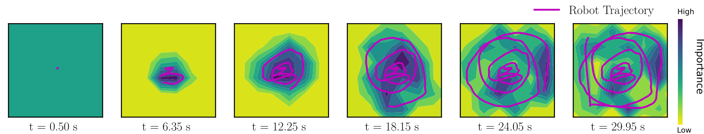
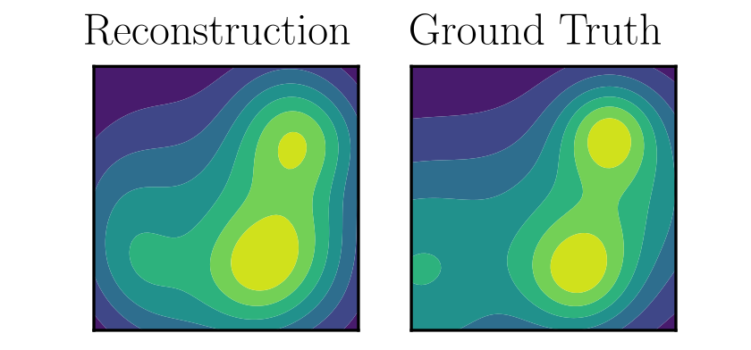
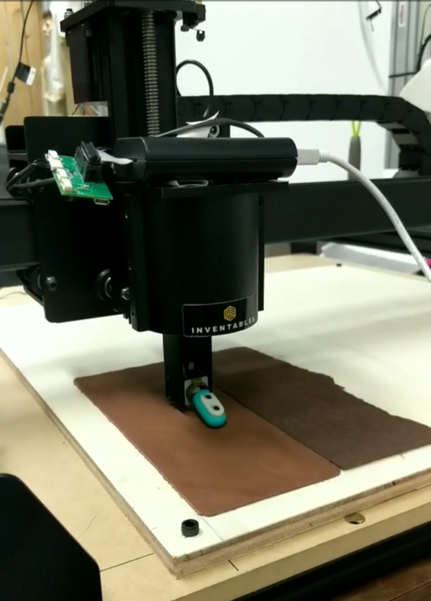

When learning a representation, the quality of the learned model (whether of the world, task or system itself) depends on the quality of data used to build the model. but how do we ensure that we explore and receive valuable information, particularly for high-dimensional search spaces where the information is sparse or hard to interpret (and therefore learn from)?

## Distribution-Based Active Exploration and the KL-Divergence Measure

For efficient learning, we want to drive the exploration of the robot to prioritize obtaining more informative data. To do this, we define an information distribution over the search space that represents the importance measure of the data (such as measures of linear independence from sparse Gaussian processes or measures representing model parameter uncertainty with respect to the search space). By defining the importance measure based on the state space, we can generate a representation of the state space that prioritizes states that generate highly informative data.

<figure>
  
  <figcaption>Top-Down view of the trajectory of the quadrotor actively acquiring data to map and reconstruct a terrain. The KL-E3 algorithm is used to explore, where the distribution the quadrotor is matching is based on the importance distribution measure over the workspace (shown in the background).</figcaption>
</figure>

We can then use information-based measures with hybrid control to generate controls that cover the search space and prioritizing high-information regions by matching the information distribution generated, while maintaining safety and stability constraints. The ergodic metric allows us to quantitatively define a measure that minimizes the distance between the information distribution and the time-averaged trajectory of the robot. Using it in the cost function allows us to generate controls that explore the full state-space while prioritizing high-information regions. The main limitation of the ergodic metric used in the active exploration algorithm is that the computational complexity of ergodicity exponentially increases with the dimensionality of the search space. To address this, we derive an active exploration algorithm using a sampling-based approximation of the ergodic metric using the Kullback-Leibler divergence metric. The sampling-based approximation allowed us to actively explore a much higher dimensional search space without sacrificing real-time control.

<figure>
  
  <figcaption>The reconstruction of the terrain from the data acquired by the quadcopter exploring using the KL-E3 exploration algorithm.</figcaption>
</figure>

## K-L Ergodic Exploration from Equilibrium

My first work using the K-L divergence based control method focused on effienctly exploring high-dimenional search spaces and the dynamics of the system itself. By using the KL-Divergence metric to explore the information distribution over the search space that represents the importance measure of the data, we were able to actively explore from a stable equilibrium to safely learn about the dynamics of the system itself.

<figure>
  
  <figcaption>The quadcopter exploring its own dynamics safely from a stable equilibrium using the KL-E3 algorithm.</figcaption>
</figure>

For more information about this project, check out the [project page](https://murpheylab.github.io/projects/CyberPhysicalSystems) or the [paper](https://murpheylab.github.io/pdfs/2018WAFRAbPrMu.pdf) and its [Github repository](https://github.com/i-abr/kle3).

## Active Exploration for Learning Haptic Language

<figure>
  
  <figcaption>The Biotac tactile sensor exploring the workspace to learn, classify and map the textures in the space.</figcaption>
</figure>

My work explores the idea of non-parametric learning for high-dimensional sensory spaces, specifically tactile exploration. Tactile exploration is a particularly interesting example of high-dimensional sensory exploration because, unlike vision, the exploratory motions used to obtain the data affect the data itself. That is, *how you move across the texture affects the sensory data received*. As such, learning and classifying texture data from exploratory motions can be a challenging problem.  

Most of the work in tactile exploration either focus on learning to translate the sensory signals to physically interpretable characteristics. Others simplify the tactile exploration for generating discriminatory motions by either mimicking human exploratory motions or by building a library of motions to discriminate particular characteristics. The question I am exploring is, *Can I learn textures and mappings of workspaces directly from the high-dimensional tactile sensory signals without trying to associate physical characteristics to the sensory signals?*

Using the Biotac tactile sensor from SynTouch, Inc., a 19-dimensional tactile sensor that mimics the sensory capabilities of the human fingertip, I explore the use of Mixture Density Networks to learn, model, and classify textures without a prior library of texture definitions or predefined exploratory motions. Furthermore, using the K-L divergence-based exploration algorithm in conjunction with learning techniques for mixture models,  I efficiently learn and map a texture space by prioritizing informative regions and motions for texture discrimination.

