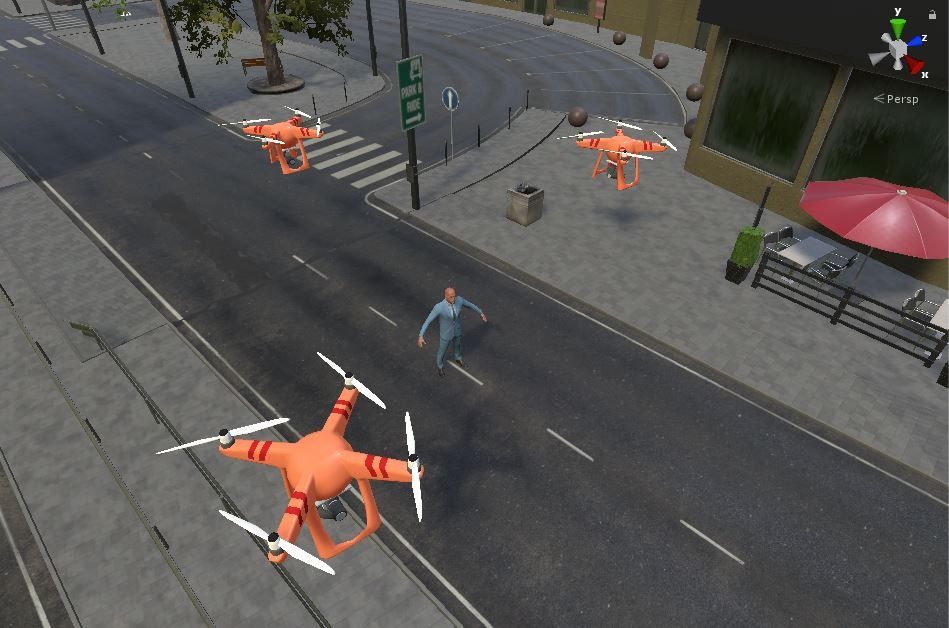
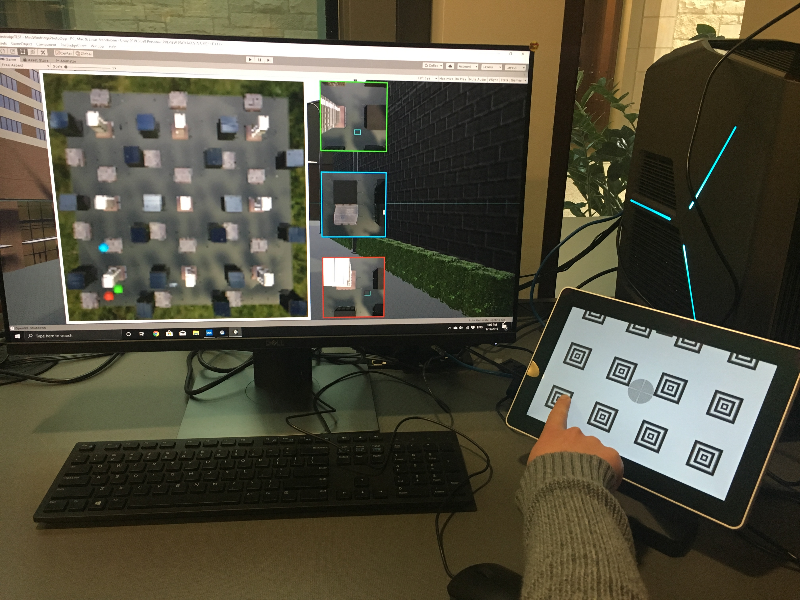
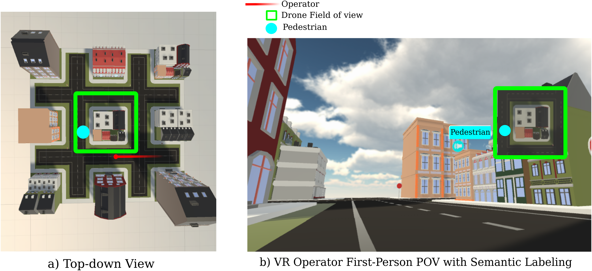

People often have to perform a variety of tasks-including search-and-rescue, target location, or exploration and terrain mapping- in unfamiliar environments. Drones deployed in the field with them have the ability to greatly improve their situational and perceptual awareness by providing feedback to aid in their task performance and safety. However, swarm deployment can be complicated, as drones can be difficult for a person to control and operate without greatly increasing their cognitive load, which can make task performance difficult and inefficient. With this in mind, I ask the question: *How can we design the human-swarm system to best improve the operator's situational awareness while minimimizing their cognitive load?*

I lead the Northwestern team on the DARPA OFFSET Sprint 3 project, exploring this idea. I developed an experimental Virtual Reality test bed with the HTC Vive and Unity VR environments to conduct human subject studies investigating these questions on collaboration. We are working on developing visual and tactile interfaces for incorporating an operator's preferences for swarm exploration. Using these interfaces, we can explore methods to incorporate the operator's real-time needs into the swarm control with minimal additional cognitive load on the operator.  



## Autonomous Swarm Control Algorithms for Perception Augmentation

Using autonomous swarm control algorithms, I can generate swarm behavior that can can reduce cognitive load on an operator, increase an operator’s situational awareness, and degrade adversary situational awareness without needing an operator to manually drive the drones nor direct swarm activity.

<figure>
  
    <figcaption>The swarm provides an operator feedback in the Unity VR environment we developed to aid situational awareness.</figcaption>
</figure>

We want the swarms to autonomously provide coverage for the operator, providing feedback in areas where the operator cannot visually see, due to distance from the operator, blind spots behind where the operator is looking and line-of-sight (LOS) occlusions from buildings, traffic, street conditions, etc. Through this, drones can provide the visual coverage to help the operator improve situational awareness to improve task performance.

To do this, I use a distribution-based approach to represent the information over the environment. By representing the search space as a distribution to be explored, we can use information-based measures, specifically ergodicity, with hybrid control techniques to autonomously control the drone swarm to aid the operator. By using the distribution-based representation with decentralized control, we can naturally accomodate changing numbers of drones in the swarm and evolving information distributions over time.



## Interface Development for Guiding Swarm Behavior for Real-time Operator Needs

One of the key benefits of the distribution-based approach is that it allows one to incorporate different priorities and metrics into guiding the swarm behavior, as long as they can be represented in the spatial distribution governing the ergodic coverage algorithm.

This allows us to provide a method of incorporating the operator's preferences or desires into the algorithm without requiring the operator to directly control each drone's trajectories nor constantly drive the swarm behavior, minimizing the additional cognitive load on the operator. To this end, I am developing visual and tactile display interfaces to communicate the operator's desires, making it at least possible that a swarm can be directed without any visual attention on the part of the operator.

<figure>
  
    <figcaption>The Tanvas tactile tablet allows the operator to communicate their preferences for coverage to the swarm controller in the Unity VR environment.</figcaption>
</figure>

## Information Rendering for Optimal Task Performance

One of the challenges with swarm-based aid is determining how to communicate information back to the operator without distracting them from the original task nor greatly increasing their cognitive load. With a single drone, direct visual feedback could sufficiently aid the operator without too much distraction, but as the number of drones in the swarm increases, directly showing the visual feed from the drones to the operator becomes infeasible. As such, we investigate how best to control the drones and communicate the information to the operator (e.g., semantic labeling, information-prioritized feedback, etc.) to most effectively aid task performance. 

<figure>
  
    <figcaption>The swarm provides an operator feedback in the Unity VR environment we developed to aid situational awareness.</figcaption>
</figure>
